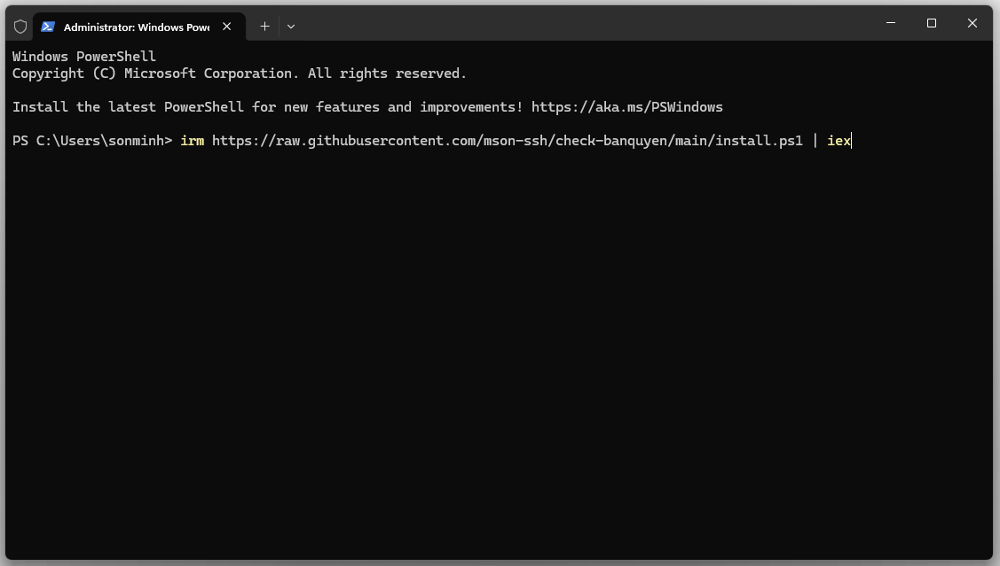
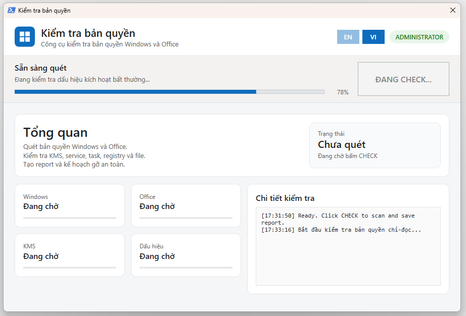
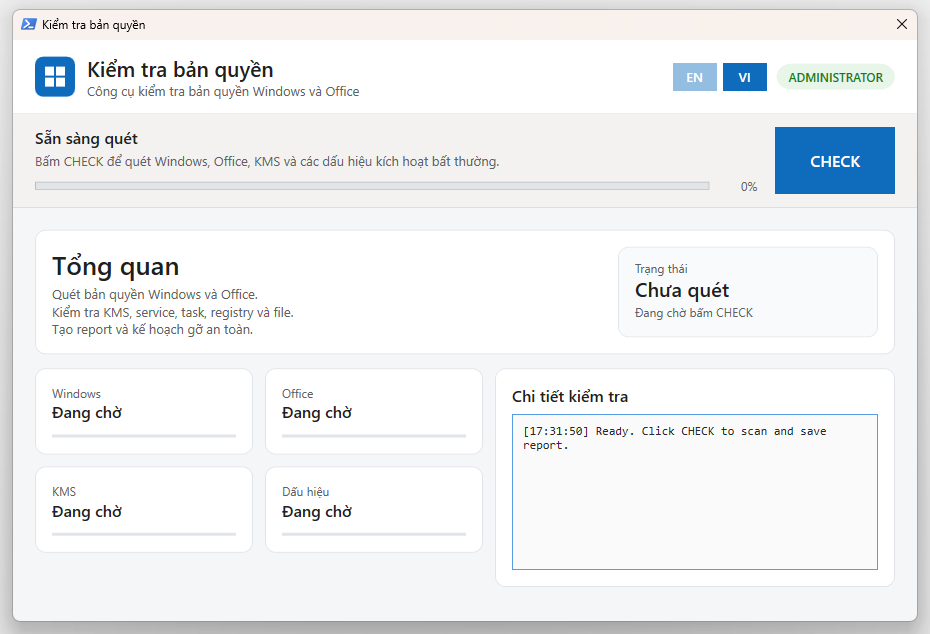
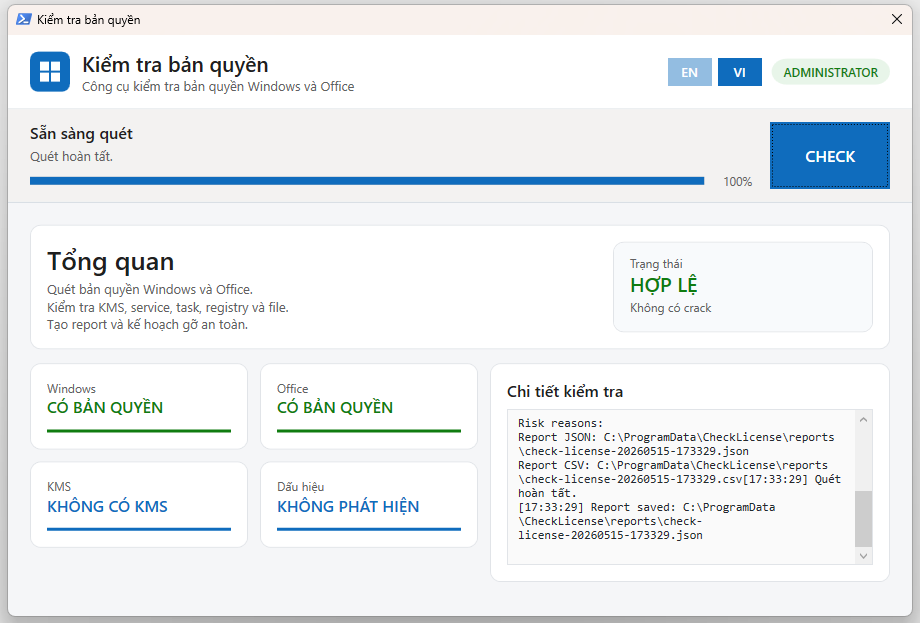

# Check License

Ứng dụng WPF nhỏ gọn giúp kiểm tra nhanh tình trạng bản quyền Windows và Microsoft Office trên máy tính Windows.



## QuickStart

Mở PowerShell và chạy một lệnh duy nhất:

```powershell
irm https://raw.githubusercontent.com/mson-ssh/check-banquyen/main/install.ps1 | iex
```

Lệnh trên sẽ tải mã nguồn mới nhất, cài tạm vào `%TEMP%\check-license` và mở giao diện WPF. Cửa sổ PowerShell gọi ban đầu sẽ được ẩn sau khi giao diện khởi động.

## Giới thiệu dự án

Check License được xây dựng để hỗ trợ kỹ thuật viên kiểm tra tình trạng bản quyền trước khi xử lý máy người dùng. Công cụ tập trung vào ba nhóm thông tin chính: bản quyền Windows, bản quyền Office và các dấu hiệu kích hoạt bất thường.

Dự án ưu tiên chế độ kiểm tra an toàn: chỉ đọc dữ liệu hệ thống, không kích hoạt sản phẩm, không thay đổi product key và không gửi dữ liệu ra ngoài.

## Tính năng chính

- Kiểm tra trạng thái kích hoạt Windows.
- Kiểm tra Office 2016, 2019, 2021, 2024, Microsoft 365 Apps và LTSC.
- Phát hiện cấu hình KMS của Windows và Office.
- Nhận diện dấu hiệu thường gặp của các công cụ kích hoạt không chính thống.
- Hiển thị kết quả trên giao diện WPF trực quan, hỗ trợ tiếng Việt và tiếng Anh.
- Tạo báo cáo JSON/CSV tại `%ProgramData%\CheckLicense\reports`.
- Hỗ trợ lập kế hoạch dọn dẹp dấu hiệu bất thường theo hướng an toàn, có backup/quarantine khi áp dụng.

## Giao diện

Giao diện WPF gồm các khu vực chính:







- Tổng quan rủi ro và điểm đánh giá.
- Trạng thái Windows, Office, KMS và dấu hiệu bất thường.
- Chi tiết kiểm tra để kỹ thuật viên đối chiếu.
- Nhật ký thao tác và đường dẫn báo cáo sau khi quét.

## Mã nguồn sử dụng

Công cụ chỉ đọc dữ liệu từ các nguồn có sẵn trên Windows và Office:

- `SoftwareLicensingProduct` qua CIM/WMI để kiểm tra bản quyền Windows.
- Registry của Software Protection Platform để đọc cấu hình KMS Windows.
- `OSPP.VBS /dstatus` trong thư mục Office chính thức để kiểm tra Office volume/perpetual.
- `vnextdiag.ps1 -action list` khi có sẵn để kiểm tra Microsoft 365 Apps/vNext licensing.
- Registry Office Click-to-Run và LicensingNext để nhận diện Office retail.
- Registry Office Software Protection Platform để đọc cấu hình KMS Office.
- Windows Services, service path, Scheduled Tasks, Run keys, IFEO debugger hooks và các đường dẫn được định nghĩa trong `src/config/rules.json` để nhận diện dấu hiệu bất thường.

Các nhóm dấu hiệu được nhận diện gồm KMS emulator/client, MAS, HWID, Ohook, TSforge, KMS38, `SppExtComObjHook.dll` và một số tên/đường dẫn phổ biến của công cụ kích hoạt không chính thống.

## Yêu cầu hệ thống

- Windows 10 21H2 trở lên hoặc Windows 11.
- Windows PowerShell 5.1.
- Kết nối internet khi chạy QuickStart để tải mã nguồn từ GitHub.

## Tham số nâng cao

Các tham số dưới đây dành cho kỹ thuật viên cần tự động hóa hoặc kiểm tra chuyên sâu:

- `-Gui`: mở giao diện WPF.
- `-Json`: in kết quả JSON ra PowerShell.
- `-NoReport`: không ghi file JSON/CSV.
- `-VerboseLog`: bật log chi tiết.
- `-ApplyCleanup`: tạo kế hoạch dọn dẹp và áp dụng khi dùng kèm `-Force`.
- `-Force`: xác nhận áp dụng cleanup trong PowerShell nâng quyền.

## Lưu ý an toàn

- Không dùng `wmic.exe`.
- Không kích hoạt Windows hoặc Office.
- Không thay đổi product key.
- Không đọc full product key; chỉ hiển thị partial key nếu hệ thống cung cấp.
- Không quét lịch sử Windows Defender.
- Điểm rủi ro chỉ là tín hiệu kiểm tra tuân thủ, không phải kết luận pháp lý.
